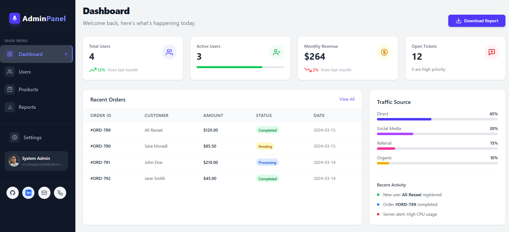
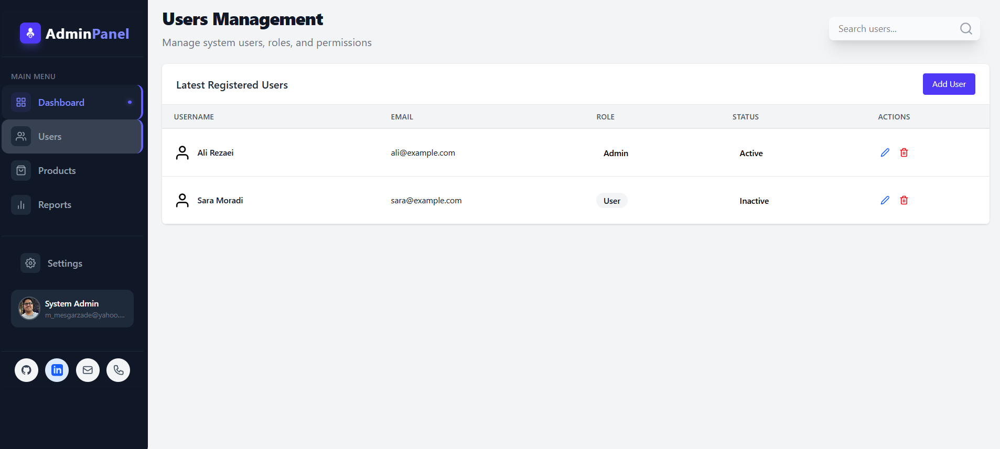
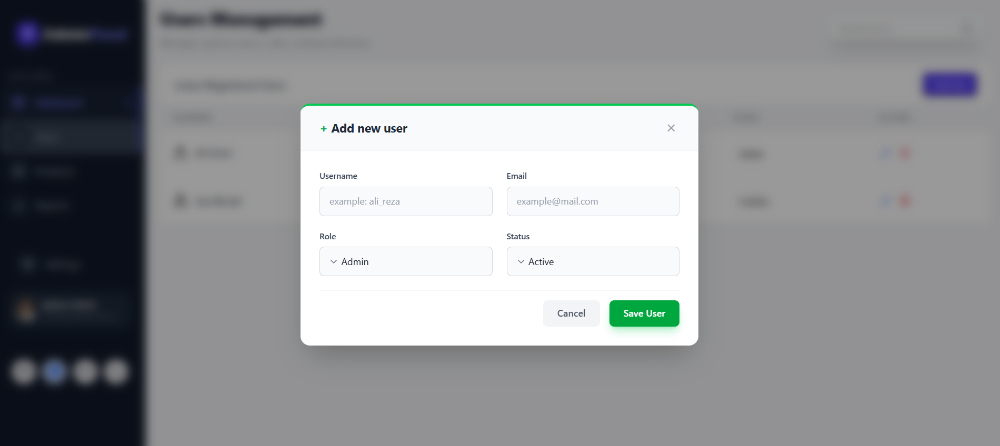
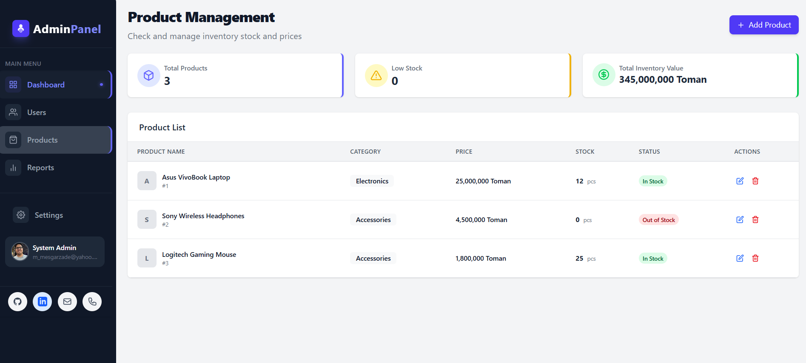
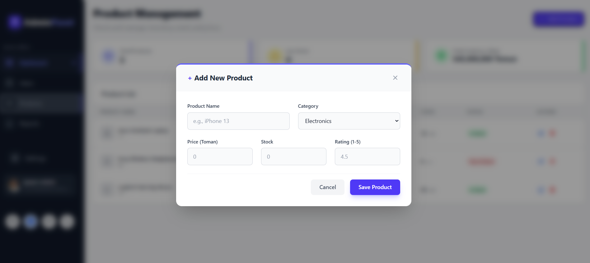
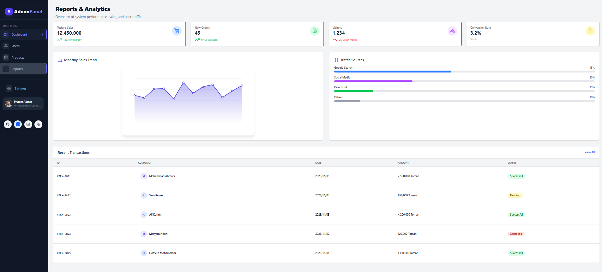
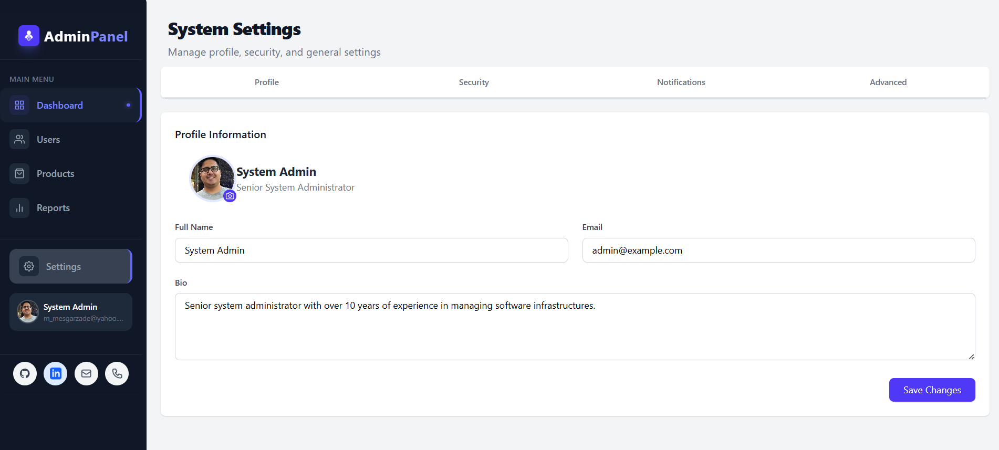
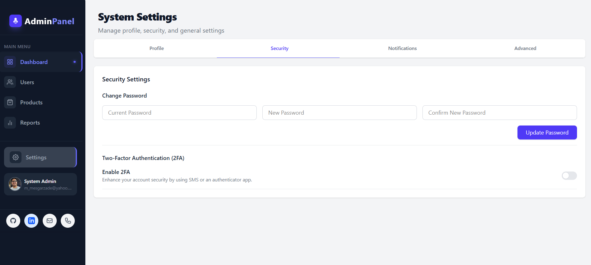
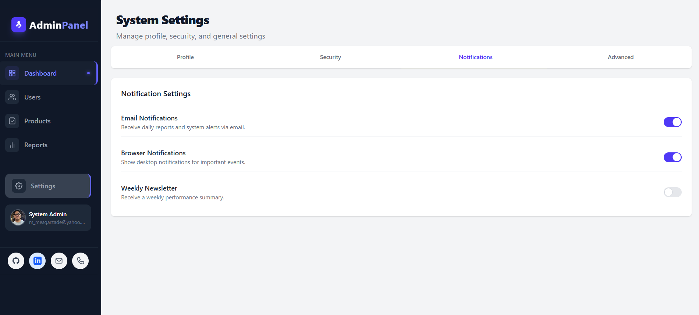
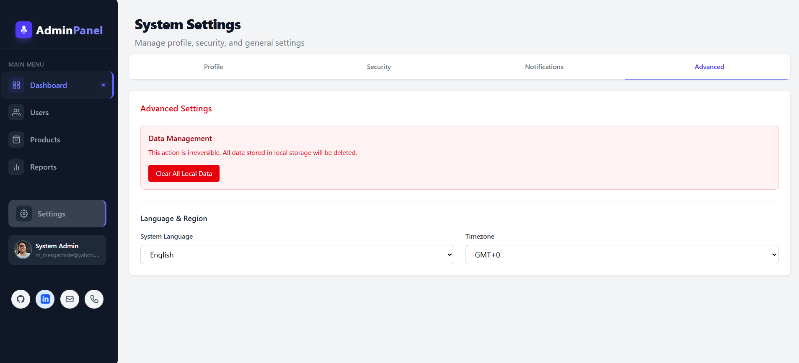

# admin-panel
A modern and professional Admin Panel Dashboard project for managing users, products, and reports. This project is built using HTML, Tailwind CSS, and JavaScript, featuring a responsive UI, data management system, sales analytics chart, and SPA routing functionality.

## ✨ Features

- 👤 User management system (add, edit, delete users)  
- 📦 Product management (full CRUD operations)  
- 🔍 Search and edit functionality  
- 📊 Sales analytics chart using Canvas  
- 🔄 SPA routing (single-page application navigation)  
- 📱 Fully responsive design (mobile & desktop)  
- 💾 Data persistence using LocalStorage  

[Demo Project](https://mohammad-mesgarzadeh.github.io/admin-panel)

- get in touch with me via *mohammadmesgarzadeh8@gmail.com*

<h3 align="left">Connect with me:</h3>

	

